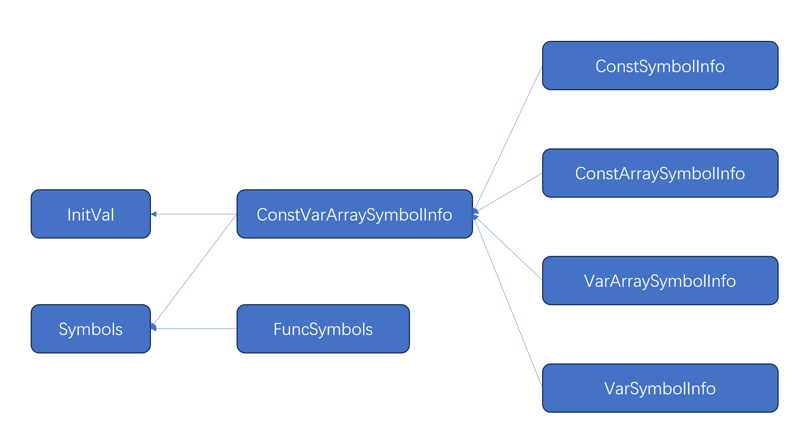

# 编译原理研讨课实验二实验报告

[toc]

## 实验内容

完成中间代码的生成，中间代码可以考虑生成LLVM IR（可以通过llc编译，lli解释执行），如果为自己设计的IR，则需要在代码中加入一个IR的解释器。
评测标准为：运行输出结果与gcc 11.4编译运行结果逐字符比对相同。


## 组员

- 潘泓锟
- 朱辰
- 郑舜泽


## 实验设计

### 编译器的目录结构

/cc/src/

    SemanticAnalyzer.h
     SemanticAnalyzer.cpp: 语义分析器，负责进行语义的检查，并生成 IR 类
     symbolTable.h
     symbolTable.cpp: 符号表的建立，将符号与构建的 IRValue 建立对应关系
    
    IR/: 生成的 IR 类，并且调用这些类来打印出最终的 IR 代码
    
    Interpreter/:
        TemporaryVariable.h
        TemporaryVariable.cpp 临时变量
        Interpreter.h
        Interpreter.cpp 解释器

### 语义检查

语义检查主要负责在遍历语法树的时候，根据要求的语言规范检查是否有语义错误，如强制类型转换，数组赋值不正确等等。同时在分析的过程中建立block，block 的符号表，全局块，函数表等，方便后续添加 `IRValue` 进行 IR 类和代码的生成

##### 符号表类继承关系图



#### 常量声明节点处理

```c++
// 处理常量声明（const类型）
std::any SemanticAnalyzer::visitConstDecl(HelloParser::ConstDeclContext *context) {
    // 解析基础数据类型（int/float等）
    DataType dataType = Utils::stot(context->btype()->getText());
    for (auto constDef : context->constDef()) {
        constDef->dataType = dataType; // 传递数据类型到子节点
        visit(constDef); // 处理具体常量定义（包括数组）
    }
    return {};
}
```
visitConstDecl函数负责处理常量声明语句，首先解析基础数据类型（如 int、float 等），然后遍历该声明中的所有常量定义（constDef），将数据类型传递给每个常量定义节点，并递归调用 visit(constDef) 进行具体处理。该函数作为常量声明的统一入口，确保了同一声明中的多个常量具有一致的数据类型，并为后续的常量定义（包括普通常量和数组常量）处理提供了必要的类型信息基础，从而保证常量在符号表中的正确注册和类型安全。


#### 常量节点初始化

```c++
// 处理常量初始化值（支持字面量和数组初始化）
std::any SemanticAnalyzer::visitConstInitVal(HelloParser::ConstInitValContext *context) {
    // 处理单个字面量初始化（非数组）
    if (context->constExp()) {
        visit(context->constExp()); // 解析常量表达式
        // 设置常量初始值（符号表中存储初始值）
        currentSymbol->setInitValue(context->constExp()->getText(), context->dataType);
    } else {
        // 处理数组初始化列表
        int expectedSize = std::accumulate(currentSymbol->getArraySize().begin(), currentSymbol->getArraySize().end(), 1, std::multiplies<>()); // 期望的数组元素总数
        int providedSize = context->constInitVal().size(); // 提供的初始化值数量
        
        // 检查初始化列表长度是否超过数组大小
        if (providedSize > expectedSize) {
            ErrorHandler::printErrorContext(context, "Too many initializers for array");
            throw std::runtime_error("Semantic error");
        }
        
        // 递归处理每个子初始化值
        for (auto init : context->constInitVal()) {
            init->dataType = context->dataType; // 传递数据类型
            visit(init); // 处理嵌套的初始化（如多维数组）
        }
        // 填充剩余元素为默认0值
        for (int i = providedSize; i < expectedSize; i++) {
            currentSymbol->setZero(context->dataType);
        }
    }
    return {};
}
```
visitConstInitVal函数负责处理常量初始化值，支持两种形式：对于简单常量（如字面量），直接解析常量表达式并记录初始值到符号表；对于数组初始化，则检查初始化列表长度是否匹配数组维度（超限时报错），并递归处理每个嵌套的初始化值，未显式初始化的元素自动补零。该函数通过维护 currentSymbol 和类型信息（dataType）确保常量值的类型安全存储，同时实现了数组初始化的完整性检查和自动填充机制。

#### 变量声明节点处理

```c++
// 处理变量声明（var类型）
std::any SemanticAnalyzer::visitVarDecl(HelloParser::VarDeclContext *context) {
    // 解析基础数据类型
    DataType dataType = Utils::stot(context->btype()->getText());
    for (auto varDef : context->varDef()) {
        varDef->dataType = dataType; // 传递数据类型
        visit(varDef); // 处理具体变量定义（包括数组和初始化）
    }
    return {};
}
```
visitVarDecl函数负责处理变量声明语句，首先解析基础数据类型（如 int、float 等），然后遍历该声明语句中的所有变量定义（varDef），将数据类型传递给每个变量定义并调用 visit(varDef) 进行具体处理。该函数作为变量声明的入口点，实现了类型信息向各个变量定义的传递，确保同一声明语句中的多个变量具有统一的数据类型，为后续的变量定义处理（包括普通变量、数组及初始化等）提供类型基础。

#### 函数定义节点处理

```c++
// 处理函数定义
std::any SemanticAnalyzer::visitFuncDef(HelloParser::FuncDefContext *context) {
    // 解析返回类型（默认void，否则解析基础类型）
    DataType returnType = (context->funcType()->btype()) ? 
        Utils::stot(context->funcType()->btype()->getText()) : DataType::VOID;
    std::string funcName = context->Ident()->getText(); // 函数名
    int line = context->Ident()->getSymbol()->getLine(); // 声明行号
    
    // 添加函数符号到全局作用域
    currentFunc = globalBlock->addNewFunc(funcName, line, returnType);
    BlockInfo *oldBlock = currentBlock; // 保存当前作用域
    // 创建函数作用域（子作用域）
    currentBlock = globalBlock->addNewBlock(currentFunc);

    visit(context->funcFParams()); // 处理函数参数
    visit(context->block()); // 处理函数体（复合语句）
    
    currentBlock = oldBlock; // 恢复外层作用域
    return {};
}
```
visitFuncDef函数是语义分析器处理函数定义的核心方法，主要完成以下任务：解析函数返回类型（默认为 void）、获取函数名和声明位置，并将函数符号注册到全局作用域；同时创建新的函数作用域用于管理参数和局部变量，递归处理参数列表和函数体内容，最后恢复外层作用域。该函数通过维护 currentFunc 和 currentBlock 指针实现嵌套作用域管理，确保函数定义的语义信息（如类型、作用域层次）正确记录在符号表中，为后续的语义检查和中间代码生成奠定基础。


#### 函数参数定义

```c++
// 处理单个函数参数（支持数组参数）
std::any SemanticAnalyzer::visitFuncFParam(HelloParser::FuncFParamContext *context) {
    DataType dataType = Utils::stot(context->btype()->getText()); // 参数数据类型
    std::string name = context->Ident()->getText(); // 参数名
    int dimension = context->LeftBracket().size(); // 数组维度（方括号数量）
    std::vector<int> arraySize; // 数组各维度大小
    
    // 解析参数的数组维度（仅允许第一维省略，用0表示）
    for (auto size : context->IntConst()) {
        arraySize.push_back(stoi(size->getText()));
    }
    
    // 检查数组维度合法性（不允许负数或零维数组作为参数）
    if (dimension > 0 && (arraySize.size() > 0 && arraySize[0] <= 0)) {
        ErrorHandler::printErrorContext(context, "Invalid array dimension in parameter");
        throw std::runtime_error("Semantic error");
    }
    
    // 添加参数到函数符号表：区分普通参数和数组参数
    if (dimension == 0) {
        currentFunc->addParamVar(name, context->Ident()->getSymbol()->getLine(), dataType); // 普通参数
    } else {
        currentFunc->addParamArray(name, context->Ident()->getSymbol()->getLine(), dataType, arraySize, dimension); // 数组参数
    }
    return {};
}
```
visitFuncFParam 函数负责处理函数参数的定义，主要完成以下工作：首先解析参数的基本数据类型和名称，然后判断是否为数组参数（通过方括号数量确定维度），并对数组维度进行合法性检查（禁止零维或负维度）；最后根据参数类型（普通变量或数组）将其添加到当前函数的符号表中，其中数组参数会记录各维度信息。该函数实现了函数参数的完整语义检查与注册，确保参数类型正确且符合语言规范，为后续的函数调用和参数传递提供准确的类型信息。


#### 语句处理

```c++
std::any ASTtoIRVisitor::visitStmt(HelloParser::StmtContext *ctx) {
    // Example for return statement:
    if (ctx->Return()) {
        if (ctx->exp().size() > 0 && ctx->exp(0)) { // Check if exp() is not empty and exp(0) is not null
            llvm::Value *retVal = std::any_cast<llvm::Value*>(visitExp(ctx->exp(0)));
            if (retVal) {
                // Type cast if necessary (e.g. int to float if function returns float)
                // This should ideally be handled by semantic checks or explicit casts in source.
                // For now, assume type compatibility or direct use.
                llvm::Type* funcRetType = builder.getCurrentFunctionReturnType();
                if (retVal->getType() != funcRetType) {
                    // Basic implicit cast for demonstration (e.g. i1 to i32, or int to float)
                    // This is a simplification. Proper casting rules are complex.
                    if (funcRetType->isIntegerTy() && retVal->getType()->isIntegerTy()) {
                         retVal = builder.CreateIntCast(retVal, funcRetType, true, "retcast"); // true for signed
                    } else if (funcRetType->isFloatingPointTy() && retVal->getType()->isFloatingPointTy()) {
                         retVal = builder.CreateFPCast(retVal, funcRetType, "retcast");
                    } else if (funcRetType->isFloatingPointTy() && retVal->getType()->isIntegerTy()) {
                         retVal = builder.CreateSIToFP(retVal, funcRetType, "retcast_sitofp");
                    } else if (funcRetType->isIntegerTy() && retVal->getType()->isFloatingPointTy()) {
                         retVal = builder.CreateFPToSI(retVal, funcRetType, "retcast_fptosi");
                    }
                    // else: types are incompatible for simple implicit cast
                }
                builder.CreateRet(retVal);
            }
        } else {
            builder.CreateRetVoid();
        }
        return nullptr;
    }
    // Example for assignment: LVal '=' Exp ';'
    if (ctx->Assign() && ctx->lVal() && ctx->exp().size() > 0 && ctx->exp(0)) {
        llvm::Value *lvalAddr = std::any_cast<llvm::Value*>(visitLVal(ctx->lVal())); // Should return address
        llvm::Value *valToStore = std::any_cast<llvm::Value*>(visitExp(ctx->exp(0))); // Should return value

        if (!lvalAddr || !valToStore) {
            std::cerr << "Error in assignment: null lval address or value." << std::endl;
            return nullptr;
        }
        
        // Type check / cast if necessary (valToStore to type of lvalAddr points to)
        llvm::Type* lvalPointsToType = nullptr;
        if (auto ptrType = llvm::dyn_cast<llvm::PointerType>(lvalAddr->getType())) {
            lvalPointsToType = ptrType->getElementType();
        } else { // GEP can return non-pointer if all indices are 0 for a scalar global. Unlikely for typical LVal.
            std::cerr << "LVal address is not a pointer type." << std::endl;
            return nullptr;
        }


        if (valToStore->getType() != lvalPointsToType) {
            std::cerr << "Type mismatch in assignment. LHS: "/* << lvalPointsToType->getDescription()*/
                      << " RHS: " /*<< valToStore->getType()->getDescription() */<< ". Attempting cast." << std::endl;
            // Add casting logic similar to return statement if needed.
            // For now, assume types are compatible or semantic analysis ensured this.
            // valToStore = builder.CreateBitCast(valToStore, lvalPointsToType); // Risky without type checks
        }

        builder.CreateStore(valToStore, lvalAddr);
        return nullptr;
    }

    // If it's an expression statement: Exp ';'
    if (ctx->exp().size() > 0 && ctx->exp(0) && !ctx->Assign() && !ctx->Return() /* and other keywords */) {
        visitExp(ctx->exp(0)); // Evaluate for side effects
        return nullptr;
    }
    
    if (ctx->block()) {
        return visitBlock(ctx->block());
    }

    // TODO: Implement other statement types (if, while, etc.)
    // For example, if ( Cond ) Stmt ( else Stmt )?
    // visitCond(ctx->cond()) -> llvm::Value* (i1 type)
    // CreateBasicBlock("then"), CreateBasicBlock("else"), CreateBasicBlock("merge")
    // builder.CreateCondBr(condVal, thenBB, elseBB_or_mergeBB)

    return nullptr;
}
```
visitStmt函数实现了语句的 LLVM IR 转换，主要处理四种语句类型：1）返回语句（自动处理返回值类型转换并生成相应返回指令）；2）赋值语句（计算左右值并生成存储指令）；3）纯表达式语句（仅计算表达式副作用）；4）复合语句块（递归处理内部语句）。该转换器通过类型敏感的指令生成（如 CreateRet/CreateStore）将源程序语义转换为 LLVM IR，同时内置基础类型转换逻辑（整型/浮点型互转），并为控制流语句预留了扩展接口，形成从 AST 到 LLVM IR 的关键转换层。

#### 处理表达式

```c++
std::any SemanticAnalyzer::visitExp(HelloParser::ExpContext *context) {
    return visit(context->addExp()); // 表达式解析从加法表达式开始
}
```

#### 处理加法表达式

```c++
// 处理加法表达式（类型一致性检查）
std::any SemanticAnalyzer::visitAddExp(HelloParser::AddExpContext *context) {
    std::vector<ReturnValue> operands;
    // 解析所有乘法表达式作为操作数
    for (auto mulExp : context->mulExp()) {
        operands.push_back(std::any_cast<ReturnValue>(visit(mulExp)));
    }
    
    // 检查所有操作数类型一致且非数组
    for (int i = 1; i < operands.size(); i++) {
        if (operands[i].getDataType() != operands[0].getDataType()) {
            ErrorHandler::printErrorContext(context, "Type mismatch in expression");
            throw std::runtime_error("Semantic error");
        }
        if (operands[i].getDimension() != 0) {
            ErrorHandler::printErrorContext(context, "Array cannot be used in arithmetic expression");
            throw std::runtime_error("Semantic error");
        }
    }
    
    return operands[0]; // 返回第一个操作数（类型已统一）
}
```
visitAddExp函数负责处理加法表达式的语义分析，首先递归收集所有乘法子表达式的操作数及其类型信息，然后严格检查所有操作数是否类型一致且均为非数组的标量值（若发现类型不匹配或数组参与运算则报错），最后返回第一个操作数作为整个加法表达式的结果类型，确保算术运算的类型安全性。


#### 处理乘法表达式

```c++
// 处理乘法表达式（类型一致性检查）
std::any SemanticAnalyzer::visitMulExp(HelloParser::MulExpContext *context) {
    std::vector<ReturnValue> operands;
    // 解析所有一元表达式作为操作数
    for (auto unaryExp : context->unaryExp()) {
        operands.push_back(std::any_cast<ReturnValue>(visit(unaryExp)));
    }
    
    // 检查所有操作数类型一致且非数组
    for (int i = 1; i < operands.size(); i++) {
        if (operands[i].getDataType() != operands[0].getDataType()) {
            ErrorHandler::printErrorContext(context, "Type mismatch in expression");
            throw std::runtime_error("Semantic error");
        }
        if (operands[i].getDimension() != 0) {
            ErrorHandler::printErrorContext(context, "Array cannot be used in multiplicative expression");
            throw std::runtime_error("Semantic error");
        }
    }
    
    return operands[0]; // 返回第一个操作数（类型已统一）
}
```
visitMulExp函数实现了乘法表达式的语义分析，其核心逻辑是：首先递归解析所有一元表达式(unaryExp)作为操作数，然后严格验证这些操作数是否满足类型一致性和非数组的约束条件（若发现类型不一致或存在数组操作数则立即报错），最终返回第一个操作数的类型信息作为整个乘法表达式的结果类型。该函数通过双重校验机制（类型匹配检查和数组维度检查）确保了乘法运算的合法性和类型安全性，其处理逻辑与加法表达式保持对称但针对乘法运算场景进行了专门的错误提示。


#### 处理一元表达式

```c++
// 处理一元表达式（支持函数调用、取反、逻辑非）
std::any SemanticAnalyzer::visitUnaryExp(HelloParser::UnaryExpContext *context) {
    if (context->primaryExp()) {
        return visit(context->primaryExp()); // 处理基本表达式（变量、数组、字面量）
    } else if (context->unaryOp()) {
        // 处理一元运算符（取反、逻辑非）
        auto operand = visit(context->unaryExp());
        ReturnValue opInfo = std::any_cast<ReturnValue>(operand);
        
        // 数组不能参与一元运算检查
        if (opInfo.getDimension() != 0) {
            ErrorHandler::printErrorContext(context, "Array cannot be used in unary expression");
            throw std::runtime_error("Semantic error");
        }
        
        std::string op = context->unaryOp()->getText();
        // 逻辑非只能用于布尔类型
        if (op == "!" && opInfo.getDataType() != DataType::BOOL) {
            ErrorHandler::printErrorContext(context, "Logical not applied to non-boolean");
            throw std::runtime_error("Semantic error");
        }
        // 取反只能用于数值类型
        else if (op == "-" && (opInfo.getDataType() != DataType::INT && opInfo.getDataType() != DataType::FLOAT && opInfo.getDataType() != DataType::DOUBLE)) {
            ErrorHandler::printErrorContext(context, "Unary minus applied to non-numeric type");
            throw std::runtime_error("Semantic error");
        }
        
        return opInfo; // 返回操作数（类型已检查）
    } else { 
        // 处理函数调用
        std::string funcName = context->Ident()->getText();
        auto func = globalBlock->lookUpFunc(funcName);
        // 未声明函数检查
        if (!func) {
            ErrorHandler::printErrorContext(context, "Undeclared function");
            throw std::runtime_error("Semantic error");
        }
        // 参数数量匹配检查
        int argCount = context->funcRParams() ? context->funcRParams()->exp().size() : 0;
        if (argCount != func->getparamNum()) {
            ErrorHandler::printErrorContext(context, "Argument count mismatch");
            throw std::runtime_error("Semantic error");
        }
        return ReturnValue(func->getDataType(), 0, {}, SymbolType::FUNC); // 返回函数返回类型
    }
}
```
visitUnaryExp 函数实现了对一元表达式的语义分析与验证，主要处理三种情况：1）对于基本表达式（变量/数组/字面量），直接递归处理；2）对于一元运算符（取反/逻辑非），严格检查操作数类型合法性（禁止数组参与运算，确保逻辑非仅用于布尔值、取反仅用于数值类型）；3）对于函数调用，验证函数是否已声明且实参与形参数量匹配。该函数通过多层类型检查确保了一元表达式运算的类型安全性，最终返回操作数的类型信息或函数返回类型，为后续语义分析提供准确的类型依据。

#### IR 设计

##### 虚拟寄存器和内存

```llvm
@global_data i32 0              ; 全局变量以@开头
def i32 main() {                ; 函数定义也以@开头
    %1 = alloca i32             ; 局部变量以%开头
    %2 = load i32, ptr @global_data
    store i32 %2, ptr %1
}
```

在上面的 IR 中，`@global_data` 和 `%1` 分别是指向全局变量和栈上局部变量的指针。所有以 % 开头的符号代表一个虚拟寄存器。llvm 假设虚拟寄存器无限多。

##### 指令类型

###### 二元运算

加减乘除，取余，比较，与，或，异或，移位运算支持。

###### 控制语句

```
; 条件跳转
br %compare_result, label %A, label %B // true跳A, false跳B
; 无条件跳转
br label %start
; 函数返回
ret void
ret int %3
```

##### SSA

静态单赋值（SSA）在 llvm 中 IR 的体现为每个虚拟寄存器只有一次赋值点。这种规定会给后续的优化带来很大的便利，但是同时也引来了麻烦，比如下面的程序。

```c++
a = 0;
if (b > 0) 
    a = 1;
else 
    a = 2;
```

如果按照 c 语言的思路，我们会这样翻译

```llvm
	%a = 0
	%1 = icmp setgt %b 0
	br %1 label %true label %false
%true:
	%a = 1
	br label %next
%false:
	%a = 2
	br label %next
%next:
```

但这样是错误的，`%a` 被赋值了 3 次，这不符合 SSA 的要求。如何修改？有两种方法。

###### 方法：phi

考虑引入 phi 语句。

```
	%a1 = 0
	%1 = icmp setgt %b1 0
	br %1 label %true label %false
%true:
	%a2 = 1
	br label %next
%false:
	%a3 = 2
	br label %next
%next:
	%a4 = phi [%a2 %true] [%a3 %false] ; 如果从%true跳转过来，值就是%a2, 如果从%false跳转过来，值就是%a3
```

上面代码中，`%a4` 使用 phi 赋值，如果上一个基本块是 `%true`，值是 `%a2`，如果上一个基本块是 `%false`，值是 `%a3`。`%a1`，`%a2`，`%a3`，`%a4` 是 a 的值。可以看出，引入 phi 语句让变量 a 的地址消失了，取而代之的是 a 的值。

##### 常量的表示

在 IR 中，对于单个常量变量，如果其被使用，我们用其值当作立即数放入指令中。对于常量数组，为了方便起见我们将其存储为一个全局数组。

##### IR文件设计

IR目录下各个文件设计主要参考llvm1.0的设计，这里不过多赘述，仅做了简单适配，并没有对其原本代码框架进行大量重构。

#### 测试脚本

1.semantic_interpret_test

依次使用 compiler 在 semantic 测试样例上运行，只进行语法检查

如果语法检查的结果为 true，我们就重新在这个样例上运行 compiler，并加入 "-simulate" 选项，解释执行，打印出返回值

```shell
#!/bin/bash

build_dir=$(pwd)

cd ..

prj_dir=$(pwd)

compiler="$build_dir/compiler"

sample_dir="$prj_dir/test"

test_name="semantic"

function unit_test() {
    filename=$(basename "$1")
    ans=$(echo "$filename" | grep -E "(true|false)" -o | tail -n 1)
    $compiler "$1" 2>/dev/null
    return_value=$?
    if [[ $return_value -eq 1 ]]; then
        out="false"
    elif [[ $return_value -eq 0 ]]; then
        out="true"
        if [[ "$filename" == "20_true_builtin_func.cact" ]]; then
            echo Skip interpret "$2/$filename"!
        else
            $compiler "$1" "-simulate"
        fi
    else
        out="unknown return value"
    fi
    if [[ "$out" != "$ans" ]]; then
        echo semantic test failed at "$2/$filename"
        echo return value is "$return_value"
        $compiler "$1"
        exit 1
    else
        echo "$2/$filename" pass!
    fi
}

if [[ $# -eq 1 ]]; then
    unit_test "$sample_dir/$1" "$(dirname "$1")"
else
    for dir in "$sample_dir"/samples_"$test_name"*; do
        dirname=$(basename "$dir")
        for file in "$dir"/*.cact; do
            if [[ -f "$file" ]]; then
                unit_test "$file" "$dirname"
            fi
        done
    done
    echo "$test_name" test pass!
fi


exit 0
```

## 实验结果

由于服务器原因，实验代码部分丢失，具体情况如下：

服务器数据丢失时，由于三个人分别负责开发的代码部分各不相同，当时正在开发的同学在本地写代码，但是当时服务器中的代码没有及时push到小组公共仓库，导致该同学本地保存下来的代码没有另两位同学在服务器开发的部分。这就导致了很大一部分代码的丢失。后续由于时间原因也没能补上这部分缺漏。

第二次实验至2025/6/25时的全部进展已体现在报告中，但是因为丢失的代码过多导致无法跑通进行实际的测试点，因此代码只具备参考意义。

## 总结与反思

本次实验较实验一在难度上有显著的提升，代码量显著提升的同时更考验我们对于编译器的理解，并非如实验一对照抄写就可完成大部分代码，代码实现难度极大提升。

此外对于极大代码量且多文件串联为统一工程的项目，我们的小组同学既没有开发经验也缺乏互相合作的经历，这就导致了我们在实验过程中的进度缓慢，开发困难，且对于开发中出现的问题，很难做到及时的沟通和解决。

以上问题导致了本次实验的进展非常的缓慢，最后的结果也不尽人意，我们也会总结本次实验中遇到的问题，加以改进，并争取更好地完成实验三的内容。

## 参考文献

LLVM 源代码[[llvm/llvm-project at llvmorg-1.0.0 (github.com)](https://github.com/llvm/llvm-project/tree/llvmorg-1.0.0)]


LLVM IR入门指南[[序言 - LLVM IR入门指南 (evian-zhang.github.io)](https://evian-zhang.github.io/llvm-ir-tutorial/)]